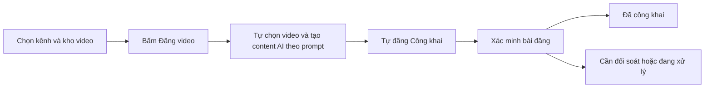

# VietDub AI Studio

**Sản xuất video, lồng tiếng tiếng Việt và quản lý xuất bản TikTok trong một ứng dụng desktop.**

VietDub AI kết hợp tải video, xử lý phụ đề, tạo giọng đọc và xuất bản nhiều kênh. Trung tâm xuất bản giúp xem trước nội dung, phân bổ mỗi kênh một video riêng và theo dõi đến bước xác nhận Công khai.

[](https://github.com/khaihoansk86-debug/Vietdub-Ai/actions/workflows/build.yml)
[](https://github.com/khaihoansk86-debug/Vietdub-Ai/releases/latest)

[Tải ứng dụng](https://github.com/khaihoansk86-debug/Vietdub-Ai/releases/latest) · [Ghi chú phát hành](RELEASE_NOTES.md) · [Báo lỗi](https://github.com/khaihoansk86-debug/Vietdub-Ai/issues)

## Tải và cài đặt

Phiên bản hiện tại: **2.2.7**.

| Nền tảng | Bộ cài |
| --- | --- |
| Windows x64 | [VietDub-AI-Setup-2.2.7.exe](https://github.com/khaihoansk86-debug/Vietdub-Ai/releases/download/v2.2.7/VietDub-AI-Setup-2.2.7.exe) |
| macOS Apple Silicon — arm64 | [VietDub-AI-2.2.7-macOS-arm64.dmg](https://github.com/khaihoansk86-debug/Vietdub-Ai/releases/download/v2.2.7/VietDub-AI-2.2.7-macOS-arm64.dmg) |

Trang release có tệp `SHA256SUMS` để đối chiếu tính toàn vẹn bộ cài. Hiện chưa cung cấp bộ cài cho Mac Intel.

1. Cài ứng dụng phù hợp với hệ điều hành.
2. Mở **Cài đặt & API**, cấu hình dịch vụ AI cần sử dụng.
3. Chọn **Sản xuất video** để xử lý nội dung hoặc **Xuất bản TikTok** để quản lý lượt đăng.

Bộ cài đã đóng gói Electron/Node.js, FFmpeg và yt-dlp. Các tính năng sau cần thêm thành phần tương ứng:

| Thành phần | Khi nào cần |
| --- | --- |
| Google Chrome | Đăng nhập và tự động hóa TikTok Studio |
| Gemini API key | Tạo/dịch phụ đề và tạo caption AI cho lượt đăng từ kho |
| OpenAI API key | Khi chọn OpenAI TTS |
| Python và `edge-tts` | Khi chọn Microsoft Edge Neural |
| Python, Git và môi trường Kokoro | Khi dùng Kokoro local; ứng dụng có quy trình thiết lập backend |
| Internet | Tải video, gọi dịch vụ AI trực tuyến và đăng TikTok |

## Tính năng

### Sản xuất video

- Nhập danh sách liên kết hoặc video/SRT từ máy tính.
- Tải và ghép clip, tạo/dịch phụ đề bằng Gemini.
- Lồng tiếng với **Kokoro local**, **Microsoft Edge Neural** hoặc **OpenAI TTS**.
- Căn nhịp giọng đọc theo từng đoạn; điều chỉnh âm lượng giọng và âm thanh gốc.
- Tùy chỉnh phụ đề, watermark và khung hình đầu ra.
- Theo dõi hàng đợi, nhật ký và video đã hoàn tất.

### Xuất bản TikTok

- Quản lý nhiều kênh với profile Chrome riêng biệt.
- Phân bổ **1:1**: mỗi kênh nhận một video riêng trong lượt đăng.
- Chống trùng bằng SHA-256 toàn file, tương thích lịch sử fingerprint cũ.
- Xem trước kênh, video, caption và hashtag trước khi bắt đầu.
- Kiểm tra video, Chrome, phiên đăng nhập và nội dung AI trước khi đăng.
- Lưu trạng thái để phục hồi khi ứng dụng hoặc kết nối bị gián đoạn.
- Dừng sau kênh hiện tại, tiếp tục phần chưa gửi, thử lại mục lỗi và đối soát bài đã gửi.
- Lưu URL/ID bài khi xác minh được kết quả; giữ nguyên kho video nguồn.

### Không gian làm việc

Giao diện chia thành các màn hình xuất bản, sản xuất và cài đặt. Màn hình xuất bản có nút Đăng video trực tiếp, trạng thái và nhật ký ngắn gọn. Hỗ trợ giao diện sáng/tối và bố cục responsive.

## Quy trình đăng Công khai 1:1



1. **Chuẩn bị kênh:** thêm tài khoản, đăng nhập qua Chrome, đóng cửa sổ đăng nhập và đồng bộ kênh.
2. **Chọn nguồn:** chọn kênh nhận và thư mục video. Các video đã công khai, đang xử lý hoặc đã tới bước gửi nhưng chưa rõ kết quả được bỏ qua để tránh trùng; giữ chỗ của lượt cũ không chặn nút đăng trực tiếp.
3. **Thiết lập nội dung:** nhập prompt AI và hashtag bổ sung. Nếu kho thiếu video, tool đăng số clip hiện có và báo kênh còn thiếu.
4. **Đăng ngay:** bấm **Đăng video** một lần. Tool tự chọn video, tạo content theo prompt và đăng công khai, không yêu cầu xác nhận lượt riêng.
5. **Theo dõi:** các kênh chạy tuần tự, có thời gian chờ và nhật ký từng video.

**Ứng dụng chỉ xuất bản ở chế độ Công khai.** Việc chuyển trang hoặc xuất hiện thông báo thành công chưa đủ để ghi nhận kết quả. Bộ xác minh đối chiếu nội dung, kênh, ID bài mới và quyền hiển thị; nếu chưa rõ, ứng dụng dừng hoặc yêu cầu đối soát.

## Chạy từ mã nguồn

Cần Node.js **20 trở lên**, npm và Git. Cài thêm Python/dependency của TTS và Google Chrome theo tính năng sử dụng.

```powershell
git clone https://github.com/khaihoansk86-debug/Vietdub-Ai.git
cd Vietdub-Ai
npm ci
npm run desktop
```

Chạy backend và giao diện web local:

```powershell
npm start
```

Mở [http://127.0.0.1:3210](http://127.0.0.1:3210). Bản Electron tự chọn cổng trống bắt đầu từ `3210`.

### Cấu hình API

Nhập khóa trong **Cài đặt & API**, hoặc tạo `.env` dựa trên `.env.example` khi chạy từ source. Chọn model khả dụng trong tài khoản của bạn.

```dotenv
HOST=127.0.0.1
PORT=3210
GEMINI_API_KEY=
GEMINI_MODEL=
OPENAI_API_KEY=
OPENAI_TTS_MODEL=gpt-4o-mini-tts
RAPIDAPI_KEY=
```

Nếu sao chép `.env.example`, đổi `HOST=0.0.0.0` trong tệp mẫu thành `HOST=127.0.0.1` để chỉ truy cập server trên máy. API local hiện chưa có cơ chế đăng nhập dành cho triển khai công khai.

Cài dependency Edge TTS nếu cần:

```powershell
python -m pip install edge-tts
```

Không đưa `.env`, API key, profile Chrome hoặc dữ liệu tài khoản lên Git. Chế độ chỉ tải/ghép video không yêu cầu dịch vụ AI; nhu cầu API phụ thuộc chế độ xử lý đã chọn.

## Dữ liệu và phục hồi

Bản desktop lưu dữ liệu tách khỏi thư mục cài đặt:

| Môi trường | Vị trí mặc định |
| --- | --- |
| Windows desktop | `%APPDATA%\vietdub-ai-local\data` |
| macOS desktop | `~/Library/Application Support/vietdub-ai-local/data` |
| Backend từ source | `data/` cho job; module TikTok trên Windows ưu tiên data AppData đã tồn tại |

Biến `VIETDUB_DATA_DIR` cho phép chỉ định chung thư mục runtime khi cần.

| Dữ liệu | Nội dung |
| --- | --- |
| `tiktok_accounts.json` | Danh sách kênh và cấu hình profile |
| `tiktok_profiles/` | Phiên Chrome riêng cho từng kênh |
| `tiktok_publish_history.json` | Lịch sử bài đăng đã xác nhận |
| `tiktok_publish_runs.json` | Phân bổ, trạng thái và nhật ký lượt đăng |
| `tiktok_publish.lock` | Khóa điều phối để ngăn tiến trình chạy chồng |

Giữ lại dữ liệu khi nâng cấp để bảo toàn phiên đăng nhập, phục hồi và chống trùng. Không xóa khóa của tiến trình đang chạy. API key không được ghi vào nhật ký lượt đăng.

## Kiến trúc mã nguồn

Ứng dụng sử dụng **Electron**, **Express/Node.js ESM**, **Vanilla JavaScript/CSS**, **Playwright + Chrome**, **FFmpeg** và **yt-dlp**.

```text
Vietdub-Ai/
├── electron/main.cjs              # Desktop shell
├── public/
│   ├── index.html                 # Các màn hình ứng dụng
│   ├── app.js                     # Sản xuất video và cấu hình
│   ├── publisher.js               # Điều hành lượt đăng
│   ├── style.css                  # Kiểu dáng nền và control
│   └── studio.css                 # Giao diện Studio
├── services/
│   ├── tiktokPublisher.js         # Chrome, metadata và đăng bài
│   ├── publishRuns.js             # Phân bổ, trạng thái, phục hồi
│   └── tiktokVerification.js      # Xác minh phiên và bài Công khai
├── server.js                      # API, dịch, TTS, phụ đề, render
├── tests/publishRuns.test.js      # Kiểm thử bộ điều phối
├── scripts/                       # Kiểm tra, checksum và vận hành
├── .github/workflows/build.yml    # Build Windows/macOS khi push tag
├── RELEASE_NOTES.md               # Thay đổi và phạm vi kiểm thử
└── handoff.md                     # Bàn giao kỹ thuật
```

## Kiểm thử và đóng gói

| Lệnh | Mục đích |
| --- | --- |
| `npm run check` | Kiểm tra cú pháp backend, frontend và module xuất bản |
| `npm test` | Kiểm thử phân bổ, chống trùng, khóa lượt, phục hồi và xác minh |
| `npm run test:ui` | Kiểm tra API/giao diện bằng Chrome với dữ liệu mô phỏng |
| `npm run build:win` | Tạo bộ cài Windows NSIS trong `dist/` |
| `npm run build:mac` | Tạo DMG arm64 trên macOS |
| `node scripts/smoke-packaged.mjs` | Mở bản Windows đóng gói bằng profile kiểm thử riêng |
| `node scripts/release-checksums.mjs` | Tạo SHA-256 cho bộ cài phiên bản hiện tại |

GitHub Actions kiểm tra và đóng gói trên Windows/macOS khi push tag `v*`, sau đó tải bộ cài cùng checksum lên Releases. Dùng tag mới cho mỗi phiên bản.

Bản 2.2.7 có 32 kiểm thử logic và 7 tình huống DOM hồi quy, cùng kiểm thử API/giao diện và khởi động bản Windows đóng gói. Luồng Post → Post now đã được kiểm chứng trên bài thật ở bản trước. Bản 2.2.7 kiểm thử 24 kênh bằng dữ liệu mô phỏng; chưa chạy một đợt đăng thật với 24 kênh. Giao diện macOS chưa được nghiệm thu trên máy Mac thật; TikTok có thể tiếp tục thay đổi giao diện.

## Hỗ trợ

Khi [báo lỗi](https://github.com/khaihoansk86-debug/Vietdub-Ai/issues), cung cấp phiên bản, hệ điều hành, bước tái hiện và nhật ký liên quan. Loại bỏ khóa API, cookie và thông tin nhạy cảm trước khi đính kèm.

Xem [ghi chú phát hành](RELEASE_NOTES.md) để theo dõi thay đổi hoặc [tài liệu bàn giao](handoff.md) để tiếp tục phát triển.


### Cập nhật 2.2.7 — Caption và lịch sử đăng

- Caption bám tiêu đề/phụ đề, không thêm lời chứng thực, công dụng hay câu tương tác thiếu căn cứ. Mẫu mặc định cũ được chuyển sang mẫu trung tính; mẫu tùy chỉnh được giữ lại.
- Không có phụ đề/tiêu đề mô tả: AI vẫn viết theo chủ đề trong prompt, hoặc lời giới thiệu trung tính nếu chưa có chủ đề. Lỗi API thật vẫn được báo rõ. Quy tắc này không bảo đảm TikTok chấp thuận hoặc phân phối video.
- Lịch sử hỗ trợ chọn từng bài/chọn tất cả và xóa bản ghi local. Xóa xong quét lại kho, sau đó bấm Đăng video để đăng các clip đủ điều kiện. Không xóa video nguồn hoặc bài TikTok; bài đã công khai có thể bị đăng trùng nếu xóa lịch sử.
- Nhận diện cảnh báo “Content may be restricted”. Tính nguyên bản, chất lượng và QR thuộc video nguồn, không thể khắc phục chỉ bằng caption. Giữ luồng Post → Post now khi TikTok cho phép.
- Không thay đổi pipeline dịch, giọng đọc hoặc render. Kiểm thử phiên bản này dùng dữ liệu mô phỏng, không đăng bài thật.

Popup kết quả và lịch sử bản 2.2.7 dùng màu theo giao diện sáng/tối, hiển thị lỗi từng kênh và không báo thành công khi chưa gửi được video. Thanh chọn/xóa có số bài đã chọn, vùng bấm rõ ràng và xác nhận xóa local.


## Cập nhật 2.2.7 — Prompt độc lập tên kênh và lịch sử dễ đọc
- Tên kênh/username không được gửi cho Gemini. Prompt quyết định chủ đề và giọng văn; title/transcript chỉ phụ trợ khi phù hợp. Cùng input, đổi tên kênh không đổi request AI (test hồi quy).
- Bảng lịch sử rộng theo cửa sổ; cột kênh/ngày giờ/trạng thái cố định, caption hiển thị nguyên văn không thêm khoảng trắng template, nền đặc và chữ theo theme. Hashtag rõ chữ, badge không ngắt dòng, nội dung dài cuộn trong modal.
- Áp dụng cho caption tạo mới; không sửa caption bài đã đăng hoặc lịch sử cũ. Không đổi dịch/TTS/render, phân bổ 1:1 và Post/Post now.
- Kiểm tra 29 test logic, UI sáng/tối với caption dài và tên Pharma, 7 DOM fixtures. Không đăng bài thật trong kiểm thử.


## Cập nhật 2.2.7 — Chống caption trùng giữa các kênh/video
Nút Đăng video kiểm tra caption với toàn bộ lịch sử local và nội dung đã tạo trong đợt hiện tại. Chuẩn hóa dấu câu, emoji, hashtag; phát hiện trùng chính xác, cùng 7 từ mở đầu hoặc độ giống cụm 2 từ >= 0.58. Gửi tối đa 60 caption cần tránh cho AI, yêu cầu thay cách mở đầu/cấu trúc trong cùng chủ đề prompt; không dùng tên kênh để đổi chủ đề. Tăng temperature lên 0.7.
AI viết lại tối đa 4 lần. Nếu vẫn gần trùng, không upload clip đó và hiển thị lỗi. Không hứa phát hiện mọi cách diễn đạt cùng nghĩa; lịch sử đã xóa không còn được đối chiếu. Không thay caption bài cũ, dịch/TTS/render hoặc thao tác Post.
Validation: 32 test logic; UI/DOM và smoke app đóng gói. Chưa đăng bài thật trong lần kiểm thử này.
